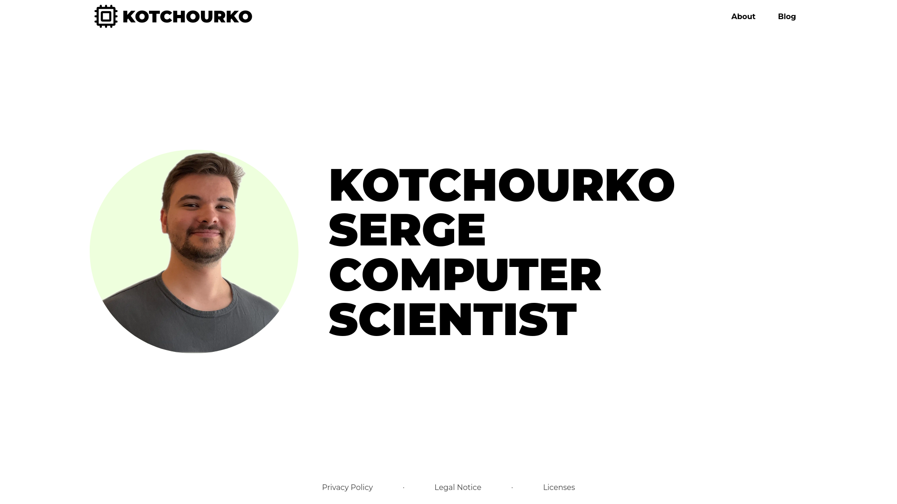

# Homepage

## Description

This is my simple [homepage](https://kotchourko-serge.de/), where I put up blogs about different topics from computer science and reference to my projects.

## Usage

Currently my [homepage](https://kotchourko-serge.de/) is hosted on [IONOS](https://www.ionos.de/). The homepage is built using mainly [Next.js](https://nextjs.org/) and [Tailwind CSS](https://tailwindcss.com/). The blog posts are written in [Markdown](https://www.markdownguide.org/) and converted to HTML using [micromark](https://github.com/micromark/micromark) and [Katex](https://katex.org/).

If you want to run the homepage locally, you can do so by cloning this repository and running `npm run dev` or `yarn dev` in the root directory after installing the dependencies. This will start a local server on port 3000.

## License

License to my code can be found [here](LICENSE). The licenses for the libraries used can be found in the [LICENSE.DEPENDENCIES.md](LICENSE.DEPENDENCIES.md) file.

## Contributing

If you have any suggestions or find any bugs, feel free to open an issue or a pull request. I will try to respond as soon as possible. You can also contact me via, which can be found on my homepage under Legal Notice.